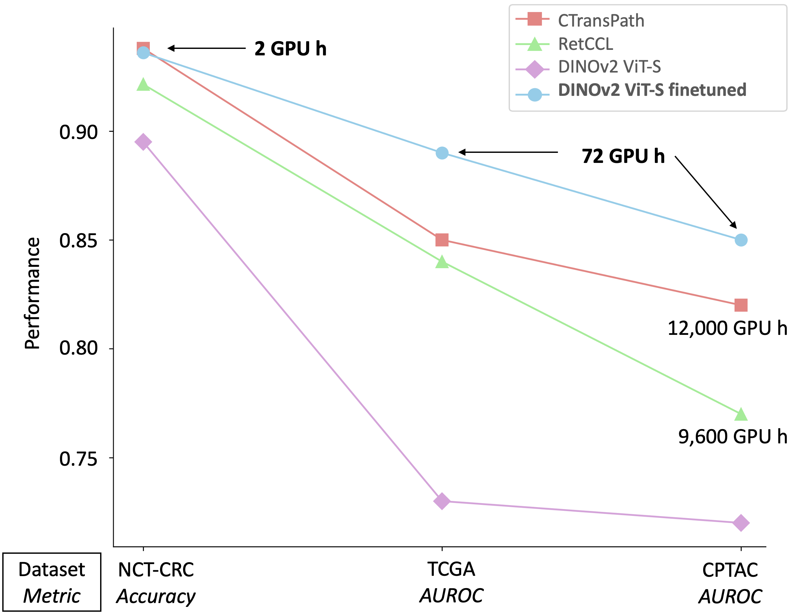
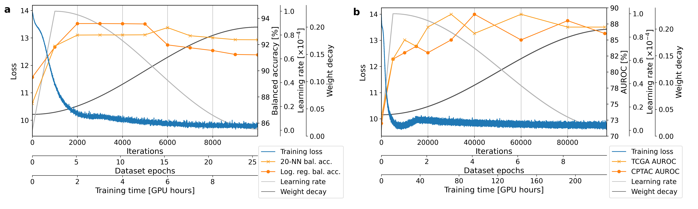

# Low-resource finetuning of foundation models beats state-of-the-art in histopathology

This is the repository of  [Low-resource finetuning of foundation models beats state-of-the-art in histopathology](https://arxiv.org/abs/2401.04720) which was accepted at ISBI 2024.
It is a slightly adapted version of the original [DINOv2](https://arxiv.org/abs/2304.07193), GitHub [repository](https://github.com/facebookresearch/dinov2/tree/main/dinov2).
## Finetuning can be compute efficient
 
We propose finetuning a DINOv2 ViT-S, which yields at least equal performance compared to CTransPath and RetCCL but in a fraction of domain specific training time. Performance is measured on three datasets: TCGA & CPTAC (WSI-level classification) and NCT-CRC (patch-level classification).

## Loss and performance over time


Performance over time of finetuning a ViT-s with DINOv2: a) on NCT-CRC and evaluating on the external NCT-
CRC testset on patch-level classification and b) on TCGA and testing on TCGA (5-fold cross-validation) and CPTAC (external
testset) on WSI-level classification.

## Data

For the finetuning process, we utilized histopathological data from two primary datasets:
- **TCGA (The Cancer Genome Atlas):** Specifically, colorectal cancer (CRC) data from the cohorts COAD and READ were used. This dataset includes annotations of microsatellite instability (MSI).
  - TCGA Dataset: [The Cancer Genome Atlas Pan-Cancer analysis project](https://doi.org/10.1038/ng.2764)

- **NCT-CRC-100K:** This dataset consists of 100,000 histological images of human colorectal cancer and healthy tissue.
  - NCT-CRC-100K Dataset: [100,000 histological images of human colorectal cancer and healthy tissue](https://doi.org/10.5281/zenodo.1214456)

For testing purposes, we incorporated two additional external datasets:
- **CPTAC (Clinical Proteomic Tumor Analysis Consortium):** For more details, visit the [CPTAC Data Portal](https://cptac-data-portal.georgetown.edu/). (Accessed: 10.11.2023)
  - CPTAC Dataset: [CPTAC Data Portal](https://cptac-data-portal.georgetown.edu/)

- **CRC-VAL-HE-7K:** This dataset, similar to NCT-CRC-100K, was employed for testing purposes.
  - CRC-VAL-HE-7K Dataset: [7180 histological images of human colorectal cancer and healthy tissue](https://doi.org/10.5281/zenodo.1214456)

We used the following testing pipeline for TCGA and CPTAC:
- **Testing Pipeline:** [HistoBistro](https://github.com/peng-lab/HistoBistro)


# Model farm
We make all models as well as heads used for training publicly available in the following.

## Pretrained models finetuned on NCT-CRC-100K

<table style="margin: auto">
  <thead>
    <tr>
      <th>model</th>
      <th># of<br />params</th>
      <th># of<br />iterations</th>
      <th>CRC-VAL-HE-7K<br />20-NN balanced acc</th>
      <th>CRC-VAL-HE-7K<br />linear balanced acc</th>
      <th>teacher backbone</th>
    </tr>
  </thead>
  <tbody>
    <tr>
      <td>ViT-S/14</td>
      <td align="right">21 M</td>
      <td align="right">2k</td>
      <td align="right">93.8%</td>
      <td align="right">92.7%</td>
      <td><a href="https://zenodo.org/records/10406135/files/dinov2_vits_NCT_10k_training_1999_teacher_checkpoint.pth?download=1">teacher weights</a></td>
    </tr>
    <tr>
      <td>ViT-g/14</td>
      <td align="right">1,100 M</td>
      <td align="right">10k</td>
      <td align="right">93.4%</td>
      <td align="right">93.7%</td>
      <td><a href="https://zenodo.org/records/10406135/files/dinov2_vitg_NCT_training_9999_teacher_checkpoint.pth?download=1">teacher weights</a></td>
    </tr>
  </tbody>
</table>

## Pretrained models finetuned on TCGA

<table style="margin: auto">
  <thead>
    <tr>
      <th>model</th>
      <th># of<br />params</th>
      <th># of<br />iterations</th>
      <th>TCGA<br />AUROC</th>
      <th>CPTAC<br />AUROC</th>
      <th>teacher backbone</th>
    </tr>
  </thead>
  <tbody>
    <tr>
      <td>ViT-S/14</td>
      <td align="right">21 M</td>
      <td align="right">30k</td>
      <td align="right">89%</td>
      <td align="right">85%</td>
      <td><a href="https://zenodo.org/records/10406135/files/dinov2_vits_TCGA_training_29999_teacher_checkpoint.pth?download=1">teacher weights</a></td>
    </tr>
    <tr>
      <td>ViT-g/14</td>
      <td align="right">1,100 M</td>
      <td align="right">60k</td>
      <td align="right">84%</td>
      <td align="right">79%</td>
      <td><a href="https://zenodo.org/records/10406135/files/dinov2_vitg_TCGA_training_59999_teacher_checkpoint.pth?download=1">teacher weights</a></td>
    </tr>
  </tbody>
</table>

### Load pretrained model 


```python
import torch
import torch.nn as nn

DINO_PATH_FINETUNED_DOWNLOADED=''

def get_dino_finetuned_downloaded():
    # load the original DINOv2 model with the correct architecture and parameters. The positional embedding is too large.
    # load vits or vitg
    model=torch.hub.load('facebookresearch/dinov2', 'dinov2_vits14')
    #model=torch.hub.load('facebookresearch/dinov2', 'dinov2_vitg14')
    # load finetuned weights
    pretrained = torch.load(DINO_PATH_FINETUNED_DOWNLOADED, map_location=torch.device('cpu'))
    # make correct state dict for loading
    new_state_dict = {}
    for key, value in pretrained['teacher'].items():
        if 'dino_head' in key:
            print('not used')
        else:
            new_key = key.replace('backbone.', '')
            new_state_dict[new_key] = value
    #change shape of pos_embed, shape depending on vits or vitg
    pos_embed = nn.Parameter(torch.zeros(1, 257, 384))
    #pos_embed = nn.Parameter(torch.zeros(1, 257, 1536))
    model.pos_embed = pos_embed
    # load state dict
    model.load_state_dict(new_state_dict, strict=True)
    return model

model=get_dino_finetuned_downloaded()
```
## Installation

This requires the same prerequisites as the original DINOv2 implementation.

The training and evaluation code requires PyTorch 2.0 and xFormers 0.0.18 as well as a number of other 3rd party packages. Note that the code has only been tested with the specified versions and also expects a Linux environment. To setup all the required dependencies for training and evaluation, please follow the instructions below:

conda (Recommended) - Clone the repository and then create and activate a dinov2 conda environment using the provided environment definition:

```python
conda env create -f conda.yaml
conda activate dinov2
```

pip - Clone the repository and then use the provided requirements.txt to install the dependencies:

```python
pip install -r requirements.txt
```

## Use the pipeline

Currently, the github repository is meant to run on one GPU only. It can simply be run by this line of code once all the hyperparameters are set in the dinov2/dinov2/configs/ssl_default_config.yaml:

```python
python dinov2/train/train.py --config-file dinov2/configs/ssl_default_config.yaml
```

If you want to use more than one GPU, it is important to change the sampler in train.py to a sampler supporting sharding (e.g. SamplerType.SHARDED_INFINITE) and to change the StateDictType in fsdp/&#95;&#95;init&#95;&#95;.py. Then the starting is done via

```python
torchrun --nproc_per_node=2 dinov2/dinov2/train/train.py --config-file dinov2/configs/ssl_default_config.yaml
```
nproc_per_node corresponds to the number of GPUs.

Of course arguments can be passed with the function as well (see also the original DINOv2).

To run it, you will have to change the paths to your own dataset in the dinov2/configs/ssl_default_config.yaml. The csv files should just contain the paths for the image files.

## Continue finetuning

If you want to continue finetuning or use the DINO heads, the remaining weights can be found here:

<table style="margin: auto">
  <thead>
    <tr>
      <th>model</th>
      <th>dataset</th>
      <th># of<br />iterations</th>
      <th>student backbone</th>
      <th>student DINO head</th>
      <th>teacher DINO head</th>
    </tr>
  </thead>
  <tbody>
    <tr>
      <td>ViT-S/14</td>
      <td>NCT-CRC-100K</td>
      <td align="right">2k</td>
      <td><a href="https://zenodo.org/records/10406135/files/dinov2_vits_NCT_10k_training_1999_student_checkpoint.pth?download=1">student backbone</a></td>
      <td><a href="https://zenodo.org/records/10406135/files/dinov2_vits_NCT_10k_training_1999_student_dino_head_checkpoint.pth?download=1">student DINO head</a></td>
      <td><a href="https://zenodo.org/records/10406135/files/dinov2_vits_NCT_10k_training_1999_teacher_dino_head_checkpoint.pth?download=1">teacher DINO head</a></td>
    </tr>
    <tr>
      <td>ViT-g/14</td>
      <td>NCT-CRC-100K</td>
      <td align="right">10k</td>
      <td><a href="https://zenodo.org/records/10406135/files/dinov2_vitg_NCT_training_9999_student_checkpoint.pth?download=1">student backbone</a></td>
      <td><a href="https://zenodo.org/records/10406135/files/dinov2_vitg_NCT_training_9999_student_dino_head_checkpoint.pth?download=1">student DINO head</a></td>
      <td><a href="https://zenodo.org/records/10406135/files/dinov2_vitg_NCT_training_9999_teacher_dino_head_checkpoint.pth?download=1">teacher DINO head</a></td>
    </tr>
    <tr>
      <td>ViT-S/14</td>
      <td>TCGA</td>
      <td align="right">30k</td>
      <td><a href="https://zenodo.org/records/10406135/files/dinov2_vits_TCGA_training_29999_student_checkpoint.pth?download=1">student backbone</a></td>
      <td><a href="https://zenodo.org/records/10406135/files/dinov2_vits_TCGA_training_29999_student_dino_head_checkpoint.pth?download=1">student DINO head</a></td>
      <td><a href="https://zenodo.org/records/10406135/files/dinov2_vits_TCGA_training_29999_teacher_dino_head_checkpoint.pth?download=1">teacher DINO head</a></td>
    </tr>
    <tr>
      <td>ViT-g/14</td>
      <td>TCGA</td>
      <td align="right">60k</td>
      <td><a href="https://zenodo.org/records/10406135/files/dinov2_vitg_TCGA_training_59999_student_checkpoint.pth?download=1">student backbone</a></td>
      <td><a href="https://zenodo.org/records/10406135/files/dinov2_vitg_TCGA_training_59999_student_dino_head_checkpoint.pth?download=1">student DINO head</a></td>
      <td><a href="https://zenodo.org/records/10406135/files/dinov2_vitg_TCGA_training_59999_teacher_dino_head_checkpoint.pth?download=1">teacher DINO head</a></td>
    </tr>
  </tbody>
</table>

To load these weights, it is enough to add the path to the config file under head_path. The path that has to be added is to a folder containing the weights. The weights have to be renamed after downloading them for the available code to work (e.g. student_dino_head_checkpoint.pth). More details can be found in the file /dinov2/dinov2/train/ssl_meta_arch.py.

## Citation

If you find our research helpful, please consider citing:

```
@misc{roth2024lowresource,
  title={Low-resource finetuning of foundation models beats state-of-the-art in histopathology},
  author={Benedikt Roth and Valentin Koch and Sophia J. Wagner and Julia A. Schnabel and Carsten Marr and Tingying Peng},
  year={2024},
  eprint={2401.04720},
  archivePrefix={arXiv},
  primaryClass={cs.CV}
}
```
